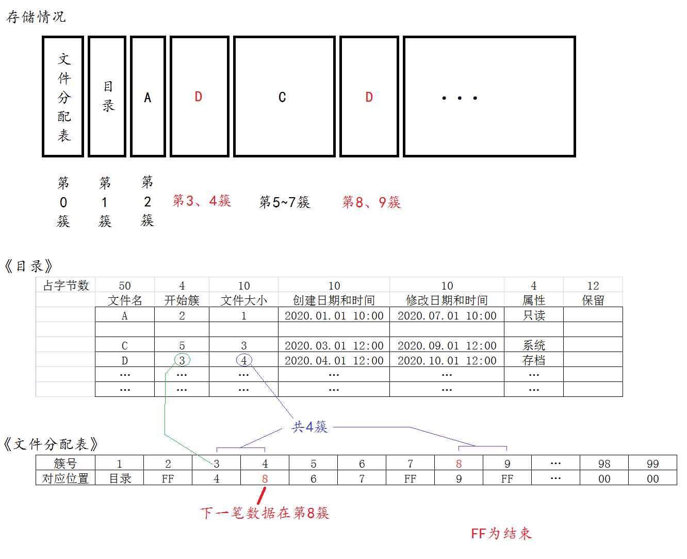

<ol>
  <h1><li>
    文件管理的作用：</h1>
    <h3>个人感觉：</h3>
    <ol>
      <li>
        封装，提供接口，层次化
      </li>
      <li>
        提高存取效率，减轻管理压力
      </li>
    </ol>
  

    
主流的系统有NTFS、FAT、exFAT、EXT等，这里主要介绍FAT。

  </li>
  <h1><li>
    FAT文件系统简介：</h1>
    
FAT(short for File Allocation Table)文件系统是个通用文件系统，兼容主流OS，如Linux、Windows等，基础于简单的技术，是Wimdows的默认文件系统。由于过于简单的结构，FAT存在过度碎片化、文件损坏与文件名、大小限制等问题。

    
FAT具有以下属性：

    <ul>
      <li>
        分区不能超过2TB(WIndows无法将大于32G的光盘格式化为FAT32，但是Mac可以。)，FAT32允许磁盘容量8TB。
      </li>
      <li>
        存储到FAT分区的文件不能超过4GB。
      </li>
      <li>
        FAT分区需要经常进行碎片整理以保持性能。(碎片化原因：当文件删除后再写入新文件时，FAT不会将文件整理成完整片段再去写入，因此长期使用会导致文件资料逐渐分散，因此减缓读写速度。)
      </li>
      <li>
        通常不建议大于32G的FAT分区存在，因为这样的空间两不适配FAT过于简单的组织结构。
      </li>
    </ul>
    
FAT多用于小容量设备，其中操作系统之间的可移植性很重要，为硬盘选择文件系统时，不建议FAT，除非是旧版本Windows

    
<b style="color:red;">注意：</b>早期部分版本使用的是FAT16，他有很多技术问题以及使用限制，不建议在任何现在的媒体上使用。

  </li>
  <h1><li>
    格式化的主要功能：</h1>
    
主要有2件事，分别为：添加文件分配表，用来记录文件存放位置，以及添加目录，用来记录文件名、开始簇以及时间戳等信息。

    <h2>什么是簇？</h2>
    
簇，是文件管理最小的一个存储单位，也就是连续空间的小块。簇的大小随着FAT文件系统的类型以及分区大小而不同，典型的簇大小介于2KB到32KB之间。每个文件根据它的大小可能占有一个或者多个簇；这样，一个文件就由这些这些（称为单向链表）簇链所表示。然而，这些链并不一定一个接着一个在磁盘上存储，它们经常是在整个数据区域零散的储存。由文件管理决定多少字节为一个簇，格式化的时候，可以设定分配单元大小，例如：以4096字节为一个簇。

    
  </li>
  <h1><li>
    文件系统的管理：</h1>
    
举个例子，先往空间里存储3个档案，记A、B、C，其大小分别为：1、2、3簇，其存储情况、文件分配表以及目录如下图：

    
    
如果这时候将B删除，第三、四簇将空出，如图：

    
    
接着添加文件D，文件大小为<b style="color:red;">4簇</b>,超过了B原本位置的2簇，所以会优先填满2簇，再去寻找空余位置继续填充，如图：

    
  </li>
  <h1><li>
    File Access（文件存取）接口：</h1>
    
<table>
      <tr>
        <td>f_open</td>
        <td>打开/创建文件</td>
      </tr>
      <tr>
        <td>f_close</td>
        <td>关闭文件</td>
      </tr>
      <tr>
        <td>f_read</td>
        <td>读取文件</td>
      </tr>
      <tr>
        <td>f_write</td>
        <td>写入文件</td>
      </tr>
      <tr>
        <td>f_lseek</td>
        <td>移动读/写指针，扩展大小</td>
      </tr>
      <tr>
        <td>f_truncate</td>
        <td>截断文件</td>
      </tr>
      <tr>
        <td>f_sync</td>
        <td>刷新缓存数据</td>
      </tr>
      <tr>
        <td>f_forward</td>
        <td>转移文件数据到一个数据流</td>
      </tr>
      <tr>
        <td>f_expand</td>
        <td>为文件分配一个连续的块</td>
      </tr>
      <tr>
        <td>f_gets</td>
        <td>读取一个字符串（string）</td>
      </tr>
      <tr>
        <td>f_putc</td>
        <td>写入一个字符（character）</td>
      </tr>
      <tr>
        <td>f_puts</td>
        <td>写入一个字符串（string）</td>
      </tr>
      <tr>
        <td>f_printf</td>
        <td>写入一个格式化字符串</td>
      </tr>
      <tr>
        <td>f_tell</td>
        <td>获取当前读/写指针</td>
      </tr>
      <tr>
        <td>f_eof</td>
        <td>文件结束测试</td>
      </tr>
      <tr>
        <td>f_size</td>
        <td>获取长度</td>
      </tr>
      <tr>
        <td>f_error</td>
        <td>测试错误</td>
      </tr>  
    </table>

  </li>
  <h1><li>
    Directory Access（目录访问）接口</h1>
    <table>
      <tr>
        <td>f_opendir</td>
        <td>打开一个目录</td>
      </tr>
      <tr>
        <td>f_closedir</td>
        <td>关闭一个已打开的目录</td>
      </tr>
      <tr>
        <td>f_readdir</td>
        <td>读取目录</td>
      </tr>
      <tr>
        <td>f_findfirst</td>
        <td>打开一个目录并读取匹配的第一个项目</td>
      </tr>
      <tr>
        <td>f_findnext</td>
        <td>查找下一个匹配的项目</td>
      </tr>
    </table>
  </li>
  <h1><li>
    File and Dirextor Management（文件和目录管理）接口:</h1>
    <table>
      <tr> 
        <td>f_stat</td>
        <td>检查文件或子目录是否存在</td>
      </tr>
      <tr> 
        <td>f_unlink</td>
        <td>删除文件或子目录</td>
      </tr>
      <tr> 
        <td>f_rename</td>
        <td>重命名/移动文件或子目录</td>
      </tr>
      <tr> 
        <td>f_chmod</td>
        <td>更改文件或子目录的属性</td>
      </tr>
      <tr> 
        <td>f_utime</td>
        <td>更改文件或子目录的时间戳</td>
      </tr>
      <tr> 
        <td>f_mkdir</td>
        <td>创建子目录</td>
      </tr>
      <tr> 
        <td>f_chdir</td>
        <td>更改当前目录</td>
      </tr>
      <tr> 
        <td>f_chdive</td>
        <td>更改当前驱动</td>
      </tr>
      <tr> 
        <td>f_getcwd</td>
        <td>检索当前目录和驱动</td>
      </tr>
    </table>
  </li>
  <h1><li>
    Volume Management and System Configuration（卷管理和系统配置）接口：</h1>
    <table>
      <tr>  
        <td>f_mount</td>
        <td>注册/注销一个工作区（挂起与否）</td>
      </tr>
      <tr>  
        <td>f_mkfs</td>
        <td>在逻辑驱动上创建一个FAT卷</td>
      </tr>
      <tr>  
        <td>f_fdisk</td>
        <td>在物理驱动上创建分区</td>
      </tr>
      <tr>  
        <td>f_getfree</td>
        <td>获取卷上的可用空间</td>
      </tr>
      <tr>  
        <td>f_getlabel</td>
        <td>获取卷标</td>
      </tr>
      <tr>  
        <td>f_setlabel</td>
        <td>设置卷标</td>
      </tr>
      <tr>  
        <td>f_setcp</td>
        <td>设置活动代码页</td>
      </tr>
    </table>
  </li>
  <h1><li>
    Storage Device Controls（存储设备控件）接口：</h1>
    <table>
      <tr>
        <td>disk_status</td>
        <td>获取设备状态</td>
      </tr>
      <tr>
        <td>disk_initialize</td>
        <td>初始化设备</td>
      </tr>
      <tr>
        <td>disk_read</td>
        <td>读取数据</td>
      </tr>
      <tr>
        <td>disk_write</td>
        <td>写入数据</td>
      </tr>
      <tr>
        <td>disk_ioctl</td>
        <td>控制设备相关功能</td>
      </tr>
    </table>
  </li>
  <h1><li>
    Real Time Clock（实时时钟）接口：</h1>
    <table>
      <tr>
        <td>get_fattime</td>
        <td>获取当前时间</td>
      </tr>
    </table>
    
  </li>
  <li>
    
  </li>
  <li>
    
  </li>
</ol>
