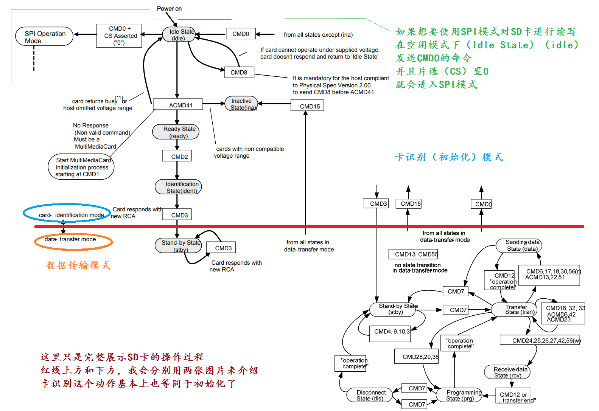
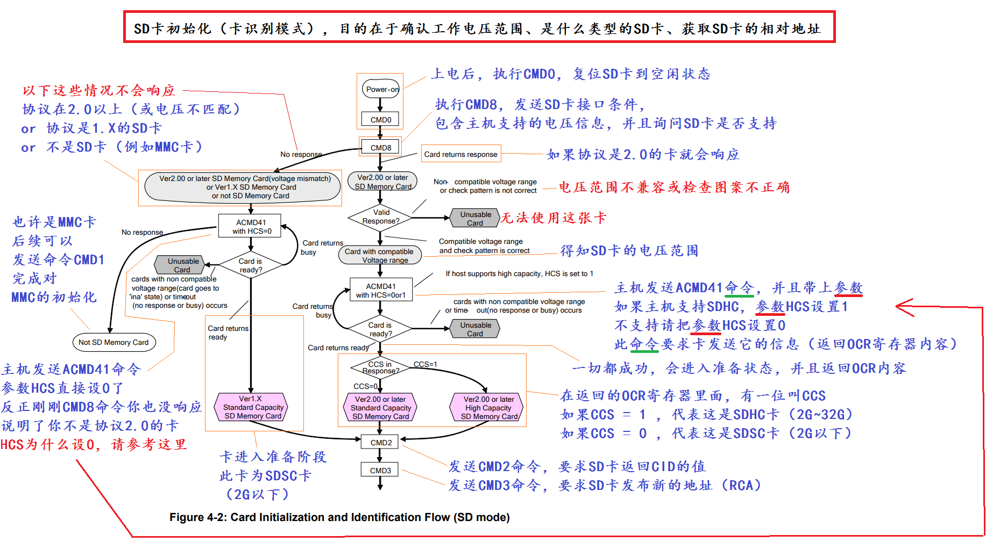
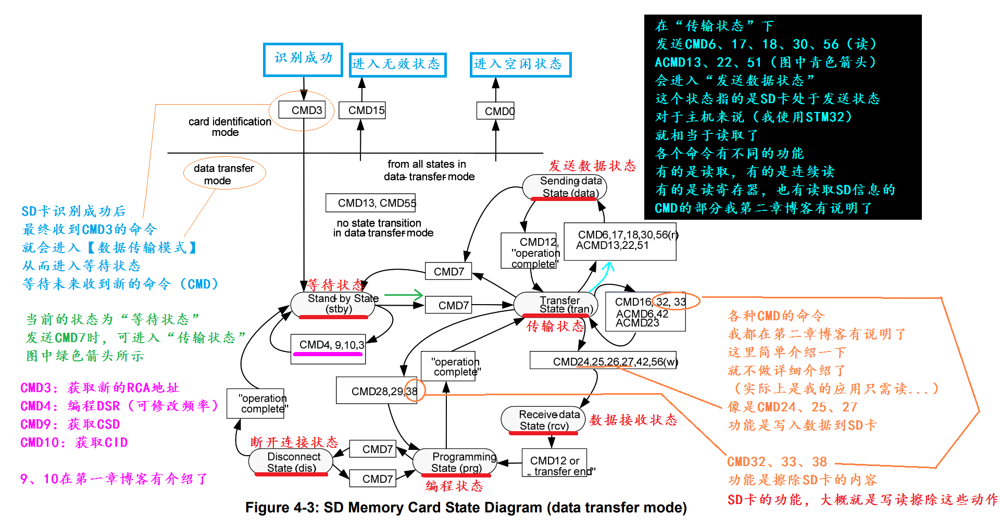

<h5>先是sd卡相关知识嗷:</h5>
  
首先，SD卡拓展了个SDIO协议(Secure Digital Input and Output)这个协议属于外部接口，可以拓展外设，相机、条码啥的。但是：<b style="color:red;">STM32F4系列，只支持SD2.0的协议，不支持一部分SDHC卡</b>SD和SDHC属于2.0这个范畴，SDXC是4.0协议，所以不支持。另外SDHC卡，有些数据块大小是512，有的是1024，STM32F4只支持读取512大小的。

  
同时，支持2种读写模式：,b>SPI Mode</b> & <b>SDIO Mode</b>。两种模式的特性如下：

  <pre>
【SDIO模式】
  CLK：时钟，通信过程需要的东西，没这个东西，数据会不稳定
  CMD：命令，可下达命令，例如读取SD卡的信息，或是写入数据等等
  DAT0、1、2、3：数据线
  VCC、VSS：电源和地
【SPI模式】
  CLK：时钟，理由同SDIO里面的CLK
  MOSI：命令或数据输出到SD卡
  MISO：SD卡传输数据到主机
  CS：片选，选择是否要操作当前的SD卡
  </pre>
  
明显能看出，因为SDIO有3根数据线，因此理论速度远比只有一根数据线的SPI快很多，同时SDIO也相当于总线，但是F4系列只支持一张卡。

  
操作SD卡有2种不同的频率，如下：

  <pre>
  第一种：识别SD卡阶段的时钟频率FOD，最高为400KHz
  第二种：后续数据传输的时钟频率FPP，默认最高为25MHz，还可以透过寄存器修改，修改后最高为50MHz。
  </pre>
  
一般SD卡中有8个register，分别如下：

  
<b>CID</b>：卡识别寄存器，一些制造商ID、版本、日期等相关讯息

  
<b>RCA</b>：相对卡地址寄存器，初始化时，动态由主机确定，后续挂载在SDIO总线上时，透过RCA找到对应的SD卡来进行操作

  
<b>DSR</b>：驱动级寄存器，配置卡的输出驱动

  
<b>CSD</b>：卡的特殊数据寄存器，SD卡的操作信息

  
<b>SCR</b>：SD配置寄存器，SD卡的特殊信息

  
<b>OCR</b>：操作条件寄存器，例如SD卡的电压信息

  
<b>SSR</b>：SD状态寄存器，SD卡专有的特征信息

  
<b>CSR</b>：SD卡状态寄存器，SD卡的状态信息

  
  

  
  
在SDIO中，存在发送命令的CMD线与数据传输的DAT线。正常情况主机通过CMD发送命令后，SD卡可能会CMD响应，可能会DAT响应，可能主机可以继续发送DAT

  
不论命令还是响应，其起始位一定为0，终值为一定为1，传输标志在命令时为1，响应时为0，以此区分两者。

  
其整体数据包为：1位起始位，1位传输标志，7位CRC校验，1位结束位，共10bit。总长为48、136和38，其中48bit和136bit的除开那10位均为内容，但38bit的为6bit命令+32bit参数/地址信息的形式 

  
CMD主要分为2种，<b style="color:red;">特定应用命令(ACMD)</b>和<b style="color:red;">常规命令(GEN_CMD)</b>也就是CMD

  
使用SD卡制造商特定的命令则需要先发送CMD55，类似符复合命令。除了CMD外<b style="color:red;">resp是响应</b>，同样分为<b style="color:red;">R1~R7</b>，只有R2为长响应，没有R4、R5响应。

  
<a href="https://github.com/xjc147896325/Cross-hardware-recording/blob/main/SD_command%20and%20register%20list.pdf" target="_blank">这是找到的09年的一份表格，可能比较陈旧，仅供参考</a>

  
<a href="https://www.cnblogs.com/PureHeart/p/12015635.html" target="_blank">这是老哥的blog，一起参考</a>，这个markdown就是根据博客为起点的。

    
  

  

  
这个图蛮详细的，
  <del><strike>我回头找下SD2.0的PDF附上。  
  </strike></del><!-- 这里~与<del>都不好使，还是<strike>好用 -->
  <a href="https://github.com/xjc147896325/Cross-hardware-recording/blob/main/SD2.0%E5%8D%8F%E8%AE%AE%E6%A0%87%E5%87%86%E5%AE%8C%E6%95%B4%E7%89%88.pdf" target="_blank">在这。</a>

  
在卡识别模式下发送<b style="color:red;">CMD3</b>，得到RCA地址，即可进入数据传输模式.(已初始化)

  
在数据传输模式下：发送<b style="color:red;">CMD0</b>，卡会进入空闲状态，此时可重新初始化、识别。发送<b style="color:red;">CMD3</b>返回新的RCA地址。发送<b style="color:red;">CMD15</b>，卡进入无效状态，类似于umount，需重新上电才能工作。

  <h2>卡识别模式(时钟频率为FOD，最高为400k)：</h2>
  

  
与上方流程一样，只是更为详细。

  <h2>数据传输模式：(时钟频率为FPP，默认25M，最高50M)</h2>
  

  

  <h1>下面就是实战部分了，先空着嗷，下周开始。</h1>
  <pre>
  【1】STM32上电后
   ↓
  【2】对几个SDIO相关的引脚初始化（查芯片手册，哪几个引脚对应SDIO，还有时钟也要设置）
   ↓
  【3】设置中断（SDIO中断，还有优先级之类的）
   ↓
  【4】复位SDIO外设寄存器（将SDIO外设寄存器，初始化为它们的默认复位值）
   ↓
  【5】调用库函数，SDIO初始化（库函数名：SDIO_Init，一些初始化的东西，例如频率，卡识别时要先设400K，
       后续数据传输时可以调高些，另外还有设置几根数据线之类的）
   ↓
  【6】调用库函数，设置SDIO上电（库函数名：SDIO_SetPowerState，要使用SD卡，就要把电源打开）
   ↓
  【7】调用库函数，使能SDIO时钟（库函数名：SDIO_ClockCmd，和SD卡交互数据需要时钟）
   ↓
  【8】调用发送命令的库函数，开始发送命令(CMD)（我第三章博客讲的【SD卡操作流程】，卡识别（卡识别模式）的时候，
       先发CMD0这个命令(命令的介绍在第二章博客)，然后等待响应之类的）所以第8步骤的命令发送顺序是：
       CMD0 -> CMD8 -> CMD55 -> CMD41 -> CMD2 -> CMD3（由于CMD41是特定应用命令，在CMD41之前，必须发送CMD55）
   ↓
  【9】第8步骤最后发送了CMD3，进入数据传输模式，首先来获取SD的容量，卡的块大小之类的信息（发送CMD9命令）
   ↓
  【10】前9个步骤算是初始化流程，然后就可以做你想要的操作了，例如读取SD卡，或是写入数据，擦除SD卡等等
  </pre>
